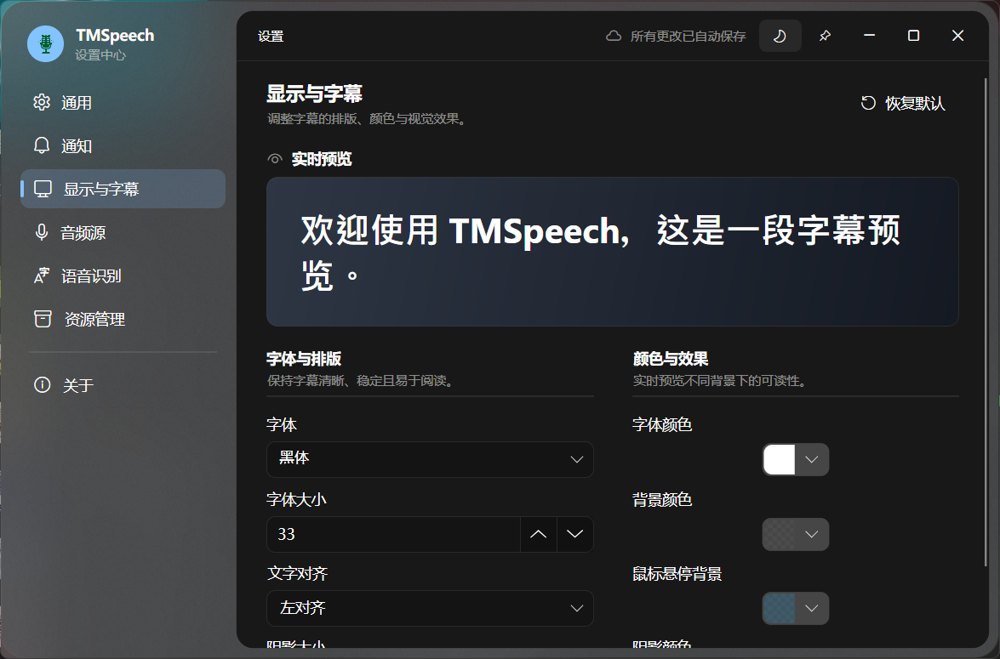
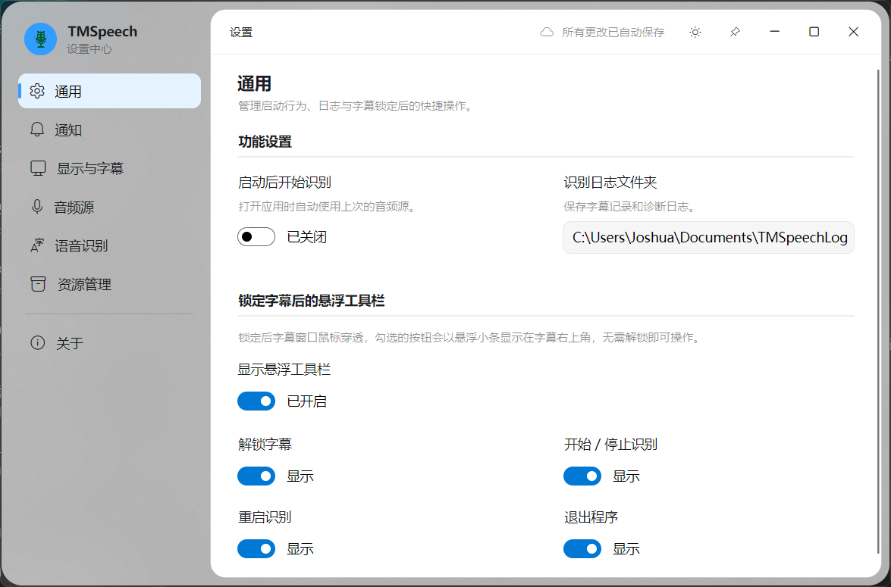

# TMSpeech2.0

面向 Windows 的实时语音字幕工具：把电脑声音、麦克风或指定进程的音频，交给本地模型、云端服务或自定义程序实时转换为文字。
原项目为[TMSpeech](https://github.com/jxlpzqc/TMSpeech), 基于TMSpeech 进行了优化，主要有：UI重构，增加ASR-LLM翻译功能等改进

[下载最新版本](https://github.com/JoshuaChen2008/TMSpeech/releases) · [报告问题](https://github.com/JoshuaChen2008/TMSpeech/issues) · [参与讨论](https://github.com/JoshuaChen2008/TMSpeech/discussions)

> TMSpeech2.0 基于 [jxlpzqc/TMSpeech](https://github.com/jxlpzqc/TMSpeech) 二次开发。新版仓库由 `JoshuaChen2008` 维护；模型与插件社区继续使用上游的 [TMSpeechCommunity](https://github.com/jxlpzqc/TMSpeechCommunity)。

## 它能做什么

TMSpeech2.0 可以捕获电脑正在播放的声音、麦克风输入，或指定进程的音频，并通过本地模型、云端语音服务或自定义程序实时转换为文字。识别结果会显示在可自由调整的置顶字幕窗口中，也可以保存到日志并在历史记录窗口中查看。

它适合在线会议、课程与直播字幕、视频内容转写、听力辅助，以及需要持续回看语音内容的场景。

你也可以：

- 开会时更放心地走神——突然被喊到时，先打开识别记录看看刚才说了什么。这也是 TMSpeech 这个名字最初的由来。
- 为网课、视频或直播生成实时字幕。
- 把会议转录保存成带时间的文本，方便之后整理纪要。
- 用本地模型保护隐私，或接入云端服务获得更多模型选择。

## 主要功能

### 多种音频来源

- **系统音频**：捕获电脑正在播放的全部声音，适合在线会议、课程、视频和直播。
- **麦克风输入**：选择当前可用的麦克风设备，实时识别自己或现场声音。
- **指定进程音频**：只捕获选定进程及其子进程的音频，减少其他应用声音造成的干扰。

使用系统回环采集时，调低或关闭扬声器音量通常不会影响识别；具体行为仍可能受到播放设备、播放器静音方式和音频驱动影响。

### 本地、云端与扩展识别

| 类型 | 识别器 | 适合场景 |
| --- | --- | --- |
| 本地识别 | Sherpa-ONNX | 使用本地模型，音频无需上传，适合重视隐私和离线使用的场景 |
| 本地识别 | Sherpa-NCNN | 另一种本地推理方案，适合已经准备好兼容模型的用户 |
| 阿里云 | NLS 实时语音识别 | 接入阿里云智能语音交互，需要开通服务并配置相应凭据 |
| 阿里云 | DashScope Fun-ASR / Paraformer | 接入阿里云百炼实时语音识别，需要 API Key |
| 通用流式 ASR | Streaming ASR | 内置阿里云 Fun-ASR、NLS 和 OpenAI Realtime 预设，也可配置兼容协议 |
| 外部程序 | 命令行识别器 | 启动用户指定的程序，将标准输出作为实时字幕 |

想完全离线运行，可以选择 Sherpa 系列；不想自己准备本地模型，可以接入云端服务；有自己的识别脚本或其他 WebSocket ASR 服务，也可以通过通用流式 ASR 或命令行识别器接进来。

识别效果会受到模型、语言、音频质量和服务配置影响，建议根据自己的场景实际测试。

### 看得清，也尽量不挡事

字幕窗口默认置顶，可以自由拖动和调整大小。需要专心看视频或开会时，可以锁定字幕窗口并启用鼠标穿透，避免误触。

锁定后仍可按需显示一条小型悬浮工具栏，并自行选择保留哪些操作：

- 解锁字幕
- 开始或停止识别
- 重启识别
- 退出程序

显示设置带有实时预览，可以调整字体、字号、文字对齐、字体与背景颜色、阴影大小与颜色，以及鼠标悬停时的背景颜色。字幕太小看不清、背景太亮，或者总是不小心点到窗口？调好以后锁住字幕，它就能安静地待在屏幕上了。

### 识别记录、日志与提醒

识别完成的句子会出现在历史记录窗口中，可以拖动选择文本，并通过右键菜单复制或全选。

每次开始识别时，TMSpeech2.0 会创建一份带时间戳的文本日志，默认保存在：

```text
我的文档\TMSpeechLogs
```

日志目录可以在设置中修改；将目录留空则不保存识别日志。

通知功能支持：

- 开启或关闭系统通知。
- 设置一个或多个关注词，以逗号或换行分隔。
- 当实时识别结果包含关注词时发出提醒。
- 在启动失败、插件异常或日志写入失败时显示错误提示。

README 中的“关注词”对应设置页面里的“敏感词”。

### 插件与资源管理

TMSpeech2.0 将音频源和语音识别器作为独立插件加载。切换插件后，设置页面会根据插件提供的配置项显示对应参数。简单来说，你可以像更换“耳朵”和“识别大脑”一样，自由组合音频源与识别器。

“资源管理”页面可以：

- 查看本地和远程资源。
- 下载并安装模型、插件和其他可选资源。
- 暂停或继续下载，并查看安装进度。
- 检查可用更新。
- 移除允许卸载的资源。

下载远程资源需要网络连接。随程序发布的内置插件可能不允许直接移除；用户安装的资源通常可以管理或卸载。欢迎在 [TMSpeechCommunity](https://github.com/jxlpzqc/TMSpeechCommunity) 贡献模型和插件。

## 界面预览

### 字幕窗口


### 识别记录







旧版视频演示：[哔哩哔哩 BV1rX4y1p7Nx](https://www.bilibili.com/video/BV1rX4y1p7Nx/)（界面和功能可能与 TMSpeech2.0 不同）。

## 安装与首次运行

### 系统要求

- Windows 10 版本 1809（内部版本 17763）或更高。
- 64 位 Windows。
- 使用云端识别器或下载资源时需要网络连接。
- 使用本地识别器时需要准备对应模型，并预留足够磁盘空间。

Release 发布包为 Windows x64 自包含版本，正常情况下无需单独安装 .NET Runtime。

### 安装

1. 前往 [Releases](https://github.com/JoshuaChen2008/TMSpeech/releases) 下载最新的 `TMSpeech.win-x64.zip`。
2. 解压到一个可长期保留的文件夹，不要直接在压缩包内运行。
3. 双击 `TMSpeech.exe`。
4. 如有需要，可以为程序创建桌面快捷方式。

### 第一次使用

1. 打开“设置 → 音频源”，选择系统音频、麦克风或指定进程。
2. 打开“设置 → 语音识别”，选择识别器并填写必要参数。
3. 本地识别器需要选择模型文件；云端识别器需要配置相应凭据。
4. 回到字幕窗口，点击“开始识别”。
5. 如果希望打开软件后自动工作，可以开启“启动后开始识别”。

第一次打开没立刻出现字幕并不一定是坏了——先给它选好“耳朵”（音频源）和“大脑”（识别器），然后再开始识别。

## 通用流式 ASR

“通用流式语音识别”用于把 TMSpeech2.0 接入支持实时 WebSocket 音频传输的 ASR 服务，目前内置：

- 阿里云 Fun-ASR（百炼）
- 阿里云 NLS
- OpenAI Realtime（实验性）
- 自定义协议 JSON

选择预设后，设置界面会动态显示该服务需要的 API Key、模型、区域、AppKey 或 AccessKey 等参数。普通用户选好预设并填写凭据即可；“自定义协议 JSON”主要面向需要适配其他服务的开发者。

协议结构和扩展方式参见[通用流式 ASR 协议解耦设计](docs/Streaming-ASR-Protocol-Design.md)。

### 凭据安全

API Key、AccessKey 等凭据会保存在本机配置文件中。密码字段在界面中会隐藏显示，但配置文件本身没有加密。

- 不要截图或分享包含凭据的设置页面。
- 不要提交或分享 `%APPDATA%\TMSpeech\config.json`。
- 怀疑凭据泄露时，请立即在对应服务商后台轮换或撤销。
- 使用云服务可能产生费用，具体以服务商计费规则为准。

## 自定义命令行识别器

如果你已经有自己的 Python、C++ 或其他语音识别程序，可以让 TMSpeech2.0 启动它，并读取其标准输出作为字幕。

可以配置命令路径、命令参数、工作目录和 `stderr` 日志保存位置。外部程序必须使用 UTF-8 输出，并遵循以下规则：

- 输出文字后加一个换行：更新当前临时字幕。
- 连续输出两个换行：确认当前句子，并将它加入历史记录和日志。
- `stderr`：用于输出诊断或错误信息；配置日志路径后，TMSpeech2.0 会将其保存下来。

例如：

```text
今天
今天天气
今天天气不错

下一句话
下一句话开始了

```

精简的 Python 输出辅助类：

```python
class SubtitlePrinter:
    def update(self, text):
        print(text, flush=True)

    def finish(self):
        print(flush=True)
```

注意：

- 命令行识别器不会使用 TMSpeech2.0 中选择的音频源，外部程序需要自行采集音频。
- 路径或参数包含空格时需要正确加引号。
- 批处理脚本不要在结尾使用 `pause`。
- 停止识别时，TMSpeech2.0 会结束该外部进程及其子进程。
- 如果外部程序异常退出，请检查配置的 `stderr` 日志。

## 从源码构建

开发环境要求：

- Windows 10/11 x64
- Git
- .NET SDK `10.0.301`（与仓库的 `global.json` 一致）

```powershell
git clone https://github.com/JoshuaChen2008/TMSpeech.git
cd TMSpeech

dotnet restore
dotnet build TMSpeech.sln -c Release
```

运行离线行为检查：

```powershell
dotnet run `
  --project tests/TMSpeech.Core.RuntimeChecks/TMSpeech.Core.RuntimeChecks.csproj `
  --no-restore -- all
```

生成 Windows x64 自包含发布包：

```powershell
dotnet publish src/TMSpeech/TMSpeech.csproj `
  -c Release `
  -r win-x64 `
  --self-contained true `
  -o publish
```

## 开发者文档

- [开发与 Release 流程](Develop.md)
- [模块与代码职责](docs/CodeMap.md)
- [插件、资源、配置和数据流](docs/Process.md)
- [TMSpeech2.0 本地改动迁移记录](docs/Migration-2026-07-11.md)
- [通用流式 ASR 协议解耦设计](docs/Streaming-ASR-Protocol-Design.md)
- [贡献者工作规范](AGENTS.md)

## 反馈与贡献

觉得很有用，但还有不顺手的地方？欢迎：

- 在 [Issues](https://github.com/JoshuaChen2008/TMSpeech/issues) 报告问题或提出功能建议。
- 在 [Discussions](https://github.com/JoshuaChen2008/TMSpeech/discussions) 分享使用体验和模型推荐。
- 通过 Pull Request 改进代码或文档。
- 在 [TMSpeechCommunity](https://github.com/jxlpzqc/TMSpeechCommunity) 贡献兼容模型与插件资源。

提交问题时，请尽量附上复现步骤、系统版本、所用音频源和识别器。请先删除日志、截图或配置文件中的 API Key、AccessKey 等敏感信息。

## 开源许可

本项目采用 [MIT License](LICENSE)。TMSpeech2.0 基于原 TMSpeech 项目继续开发，并保留原作者版权与许可证说明。
